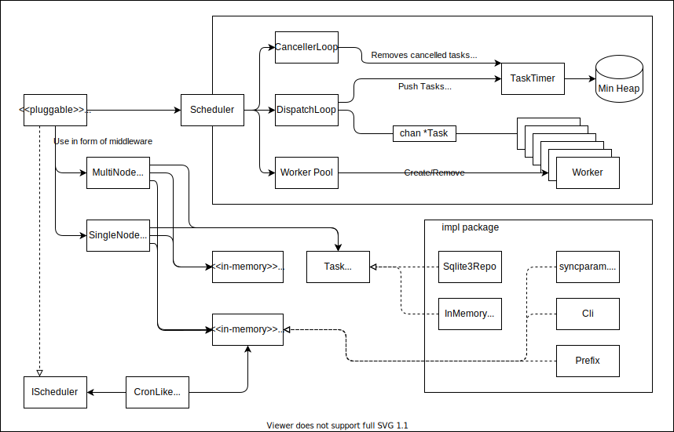

# gokugen

go+刻限(kokugen)

Gokugen is middleware-applicable scheduler built on top of min-heap backed, limitting number of concurrently-processing taks and in-memory scheduler.

刻限(kokugen) is japanese word that means an appointed time, scheduled time, or due.

## Idea

The idea is based on [this article](https://qiita.com/kawasin73/items/7af6766c7898a656b1ee)(written in japanese).

`./scheduler` contains similar but modified implementation.

### Differences

- It removes cancelled tasks from min-heap at every one minute.
- It passes 2 channels to task that would be closed if scheduler is ended and the task is cancelled respectively.
- It has countermeasurement for abnormally-returned work (i.e. calling runtime.Goexit or panicking). But not tested yet!
- Task cancellations are controlled by Cancel method of struct instance returned from Schedule.
- Cancellation of scheduler is controlled by context.Context.

### Additonal Properties

See below packages section.

## Architecture

simplified architecture.



## TODO

- [x] Reimplement funtionality
  - [x] in-memory shceduler
  - [x] single node task storage middleware
  - [x] cron-like interface
- [x] Implement multi node task storage middleware
- [x] Refactoring
- [ ] example package
- [ ] Add detailed careful test.

## Packages

### ./scheduler

Scheduler is in-memory scheduler.

With WorkerPool, scheduler limits how many tasks are being concurrently worked on.
And with min-heap backed TaskQueue, task retrieval complexity is O(log n) where n is number of scheduled task.

See `./example/simple/main.go ` for exmpale usage.

#### Usage

```go
package main

import (
	"context"
	"fmt"
	"time"

	"github.com/ngicks/gokugen/scheduler"
)

func main() {
	// 1st arg is worker num inittially created
	// 2nd arg is max of internal min-heap. 0 is unlimited.
	var initialWorkerNun, queueMax uint
	sched := scheduler.NewScheduler(initialWorkerNun, queueMax)

	ctx, cancel := context.WithCancel(context.Background())
	// Start starts scheduler.
	go sched.Start(ctx)

	var then time.Time
	var work scheduler.WorkFn
	task := scheduler.NewTask(then, work)
	controller, err := sched.Schedule(task)
	if err != nil {
		// scheduling failed.
		// Queue max or trying to schedule after scheduler already ended.
		panic(err)
	}

	// You can check if task is cancelled
	controller.IsCancelled()
	// You can check if task is done
	controller.IsDone()
	// You can cancel
	cancelled := controller.Cancel()
	if !cancelled {
		fmt.Println("task is already cancelled")
	}

	// You can check how many workers are actively working on task.
	fmt.Println(sched.ActiveWorkerNum())
	// You can increase the number of Workers in WorkerPool
	sched.AddWorker(5)
	// You can decrease the number of Workers in WorkerPool.
	sched.RemoveWorker(5)

	// some time later...

	// cancel ctx before calling End.
	cancel()
	// Call End to tear down scheduler and all internal objects.
	// and to wait until all goroutines terminate.
	sched.End()
}
```

### ./heap

Min-heap with added Exclude and Peek method.

Used in scheduler as TaskQueue.

### ./cron

Cron package contains Row, cron row like struct, and rescheduler for Row.

See `./example/cron/main.go ` for exmpale usage.

#### Usage

```go
package main

import (
	"context"
	"time"

	"github.com/ngicks/gokugen"
	"github.com/ngicks/gokugen/cron"
	"github.com/ngicks/gokugen/scheduler"
)

func main() {
	scheduler := gokugen.NewMiddlewareApplicator(scheduler.NewScheduler(5, 0))

	ctx, cancel := context.WithCancel(context.Background())
	defer func() {
		cancel()
		scheduler.Scheduler().End()
	}()
	go scheduler.Scheduler().Start(ctx)

	// Do command every year, Jan, Feb, Mar, every day, 12:30.
	row := cron.Builder{}.
		Month(1, 2, 3).
		Day().
		Hour(12).
		Minute(30).
		Command([]string{"command"}).
		Build()
	// whence is time when scheduling target starts from.
	var whence time.Time
	// reshedule occurs if shouldReschedule returns true.
	var shouldReschedule func(workErr error, callCount int) bool
	// workRegistry is used to retrieve work function associated to command
	var workRegisry interface {
		Load(key string) (value cron.WorkFnWParam, ok bool)
	}
	controller := cron.NewCronLikeRescheduler(
		row,
		whence,
		shouldReschedule,
		scheduler,
		workRegisry,
	)

	// Scheduling starts.
	// After task is done, row will be recheduled for next time matched to row's configuration.
	err := controller.Schedule()
	if err != nil {
		// somehow Schedule error
		panic(err)
	}

	// some time later...

	// Cancell cancells current task and rescheduling.
	controller.Cancel()
}
```

### ./task_storage

TaskStorage provides middlewares that stores task information to external persistent data storage.

See `./example/persistent_shceduler/main.go` for example usage.

#### Usage

```go
package main

import (
	"context"
	"fmt"
	"time"

	"github.com/ngicks/gokugen"
	"github.com/ngicks/gokugen/scheduler"
	taskstorage "github.com/ngicks/gokugen/task_storage"
)

func main() {
	scheduler := gokugen.NewMiddlewareApplicator(scheduler.NewScheduler(5, 0))

	// Repository interface.
	// External data storage is manipulated through this interface.
	var repository taskstorage.RepositoryUpdater
	// When Sync-ing, this cb is used to determine task should be restored
	// and re-scheduled in internal scheduler.
	// (e.g. ignore tasks if they are too old and overdue.)
	var shouldRestore func(taskstorage.TaskInfo) bool
	// workRegistry is used to retrieve work function associated to WorkId.
	var workRegisry interface {
		Load(key string) (value taskstorage.WorkFnWParam, ok bool)
	}
	// Context wrapper applicator function used in Sync.
	// In Sync newly created ctx is used to reschedule.
	// So without this function context wrapper
	// that should be applied in upper user code is totally ignored.
	var syncCtxWrapper func(gokugen.SchedulerContext) gokugen.SchedulerContext

	taskStorage := taskstorage.NewSingleNodeTaskStorage(
		repository,
		shouldRestore,
		workRegisry,
		syncCtxWrapper,
	)

	// Correct usage is as middleware.
	scheduler.Use(taskStorage.Middleware(true)...)

	// Sync syncs itnernal state with external.
	// Normally TaskStorage does it reversely through middlewares,
	// mirroring internal state to external data storage.
	// But after rebooting system, or repository is changed externally,
	// Sync is needed to fetch back external data.
	rescheduled, schedulingErr, err := taskStorage.Sync(scheduler.Schedule)
	if err != nil {
		panic(err)
	}

	for taskId, taskController := range rescheduled {
		fmt.Printf(
			"id = %s, is scheduled for = %s\n",
			taskId,
			taskController.GetScheduledTime().Format(time.RFC3339Nano),
		)
	}
	for taskId, schedulingErr := range schedulingErr {
		fmt.Printf("id = %s, err = %s\n", taskId, schedulingErr)
	}

	ctx, cancel := context.WithCancel(context.Background())
	go scheduler.Scheduler().Start(ctx)

	var scheduleTarget time.Time
	task, err := scheduler.Schedule(
		// To store correct data to external repository,
		// WorkId, Param is additionally needed.
		gokugen.BuildContext(
			scheduleTarget,
			nil,
			nil,
			gokugen.WithWorkIdOption("func1"),
			gokugen.WithParamOption([]string{"param", "param"}),
		),
	)
	if err != nil {
		panic(err)
	}

	// This is wrapped scheduler.TaskController.
	task.IsCancelled()

	// some time later...

	// cancel ctx and tear down scheduler.
	cancel()
	scheduler.Scheduler().End()
}
```
