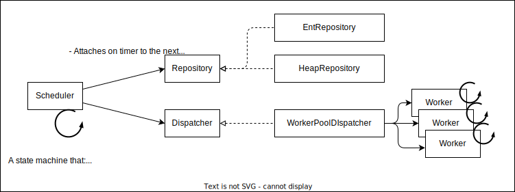

# gokugen

go+刻限(kokugen)

the idea is based on [this article](https://qiita.com/kawasin73/items/7af6766c7898a656b1ee).

Wrapping around in-memory shceduler with repository manipulator expected to make it persistant, multi node capable scheduler.

## TODO

- [ ] Reimplement funtionality
  - [ ] in-memory shceduler
  - [ ] single node task storage middleware
  - [ ] cron-like interface
- [ ] Implement multi node task storage middleware
- [ ] Refactoring
- [ ] Add detailed careful test.

## Architecture

simplified architecture

